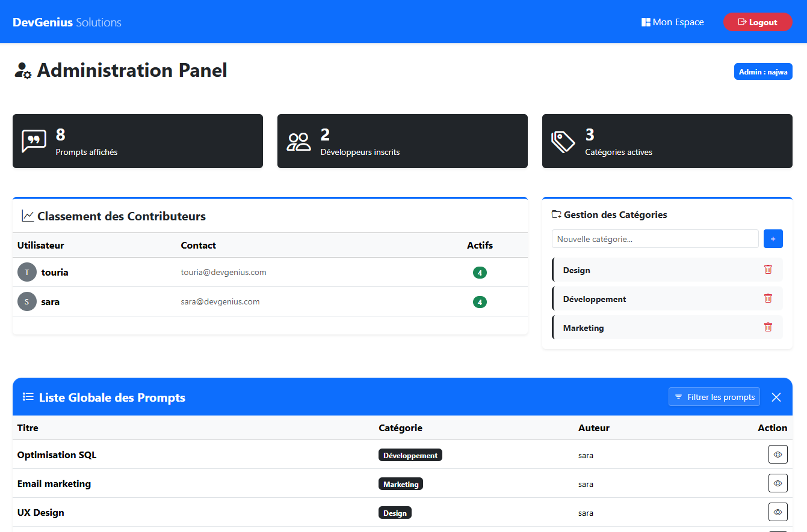
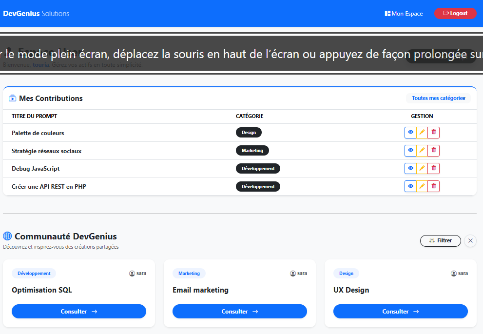

#  Prompt Repository - DevGenius Solutions

> **Plateforme de gestion et de partage de prompts LLM pour équipes techniques.**

Ce projet a été développé dans le cadre du parcours de formation "Développeur Full-Stack" (Session Mars 2026). Il permet de centraliser, filtrer et optimiser l'utilisation des IA génératives au sein d'une organisation.

---

## Technos Utilisées

Le projet repose sur une architecture **LAMP** (Linux, Apache, MySQL, PHP) moderne et responsive :

* **Backend :** PHP 8.x avec architecture procédurale modulaire.
* **Base de données :** MySQL 8.0 (Gestion via PDO pour la sécurité contre les injections SQL).
* **Frontend :** Bootstrap 5.3 (Composants natifs, Modales, Grilles responsives).
* **Icônes :** Bootstrap Icons.
* **Sécurité :** Hachage `BCRYPT` pour les mots de passe et gestion des sessions par rôles (`admin` vs `user`).

---

## Captures d'écran

### 1. Espace Administration (Dashboard)

*Aperçu des statistiques globales, du classement des contributeurs et de la gestion des catégories.*

### 2. Espace Utilisateur & Communauté

*Interface de gestion des prompts personnels et explorateur de la communauté avec filtres dynamiques.*

---

## Instructions d'Installation

Suivez ces étapes pour déployer le projet sur votre environnement local (WAMP, XAMPP ou MAMP) :

### 1. Prérequis
* Serveur local (PHP 7.4 minimum, PHP 8.2 recommandé).
* Base de données MySQL.

### 2. Clonage et placement
Décompressez l'archive ou clonez le dépôt dans votre dossier `htdocs` ou `www` :
```bash
git clone [https://github.com/najwa13/Simplon-Bootcamp.git](https://github.com/najwa13/Simplon-Bootcamp.git)
